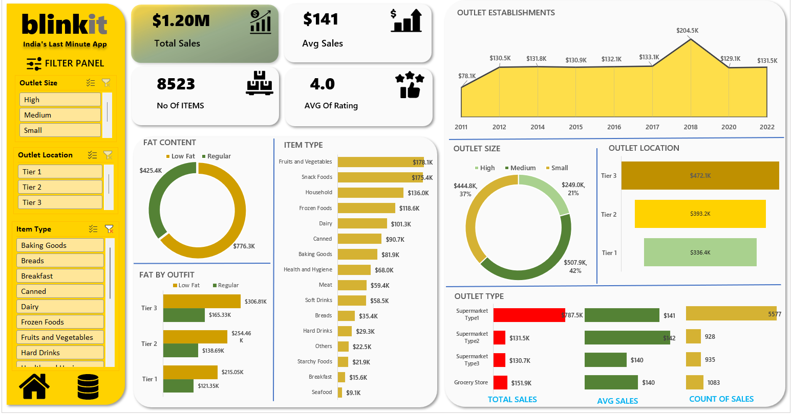

# Blinkit Sales Analysis Dashboard

An interactive Excel dashboard designed to analyze grocery sales, consumer preferences, and outlet performance metrics for Blinkit (India's Last Minute App). This project extracts insights from retail data to optimize inventory and outlet performance.

## 📊 Key Metrics & Insights
* **Total Revenue:** $1.20 Million
* **Average Ticket Size:** $141
* **Total Items Sold:** 8,523 items
* **Average Customer Rating:** 4.0 / 5.0

## 📈 Features & Visualizations
* **Outlet Performance:** Compares total sales, average sales, and item counts across Supermarket Types (1, 2, 3) and Grocery Stores.
* **Geographic & Size Segments:** Breakdown of revenue by Tier location (Tier 3 leading at $472.1K) and Outlet Size (Medium outlets contributing the most at $507.9K / 42%).
* **Product Preferences:** Analysis of fat content demand (Regular at $776.3K vs Low Fat at $425.4K) across different tiers.
* **Category Breakdown:** A ranked horizontal bar chart tracking top-selling items, led by Fruits & Vegetables ($178.1K) and Snack Foods ($175.4K).
* **Growth Trends:** Historical timeline area chart illustrating outlet establishment sales growth from 2011 to 2022 (peaking in 2018 at $204.5K).

## 🛠️ Tools Used
* **Microsoft Excel:** Advanced Data Modeling, Pivot Tables, Power Query, Slicers, and Custom Charting / UI Design.

## 📂 How to Use
1. Download or clone the repository.
2. Open the `.xlsx` file in Microsoft Excel.
3. Use the yellow filter panel on the left to dynamically segment the dashboard by Outlet Size, Location Tier, or specific Item Types.
